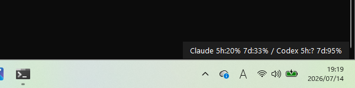

# CodexBarWin

画面右下（タスクバーの上）に常駐し、Claude CodeとCodex CLIの残り使用量を常時テキスト表示するウィジェット。



## セットアップ

  

```
pip install -r requirements.txt
python main.py
```

`tkinter`（Pythonの標準ライブラリ）のみで動作するため、`requirements.txt`の追加インストールは`pytest`（テスト用）のみ。

## 表示内容

- 画面右下に `Claude 5h:67% 7d:30% / Codex:95%` のようなテキストが常時表示される（ホバー不要）
- 文字色は白固定。背景色は右クリックメニューの「背景色を変更」から自由に選択でき、設定は次回起動時も保持される（デフォルトは`#1e1e1e`の濃いグレー）
- ウィジェットを**右クリック**するとメニューが出る:
  - 「ポーリング間隔」: 1分/5分/15分を切り替え
  - 「Windows起動時に自動起動」: チェックを入れるとスタートアップフォルダにショートカットを作成し、Windowsログオン時に自動起動する（チェックを外すと解除）
  - 「背景色を変更」: カラーピッカーで背景色を選択（設定は保持される）
  - - 「今すぐ更新」: 即座に再取得
  - 「終了」: アプリを終了
- **Claude**: 5時間枠 / 週間枠の利用率（`GET /api/oauth/usage` から取得）
- **Codex**: primary / secondary 枠の利用率（`codex app-server` の `account/rateLimits/read` から取得）

## 既知の制約・リスク

- **Claude側は非公開APIを使用**: `https://api.anthropic.com/api/oauth/usage` はAnthropicが公式にドキュメント化・サポートしているAPIではなく、予告なく変更・廃止される可能性がある。
- **Claude取得は通常5分間隔**: 画面の更新間隔が1分でも、Claude APIへのアクセスは5分未満では再送しない。HTTP 429を受信した場合だけ、`Retry-After`に従って指定時間まで自動的に待機する。
- **表示の意味**: `Claude:RATE LIMITED` はAnthropic側の取得頻度制限、`(stale)` は待機中に最後の正常値を表示している状態、`Claude:N/A` は認証・通信・応答形式などその他の取得失敗を示す。
- **Claudeの認証トークン失効時は自動リフレッシュしない**: `~/.claude/.credentials.json` のアクセストークンをそのまま使う。Claude Codeを定期的に使っていればトークンは自動更新されるが、長期間Claude Codeを起動しない場合はトークンが失効し「Claude: N/A」表示になることがある。
- **Codex側は公式API**: `codex app-server` の `account/rateLimits/read` はOpenAIがオープンソースで公開しているJSON-RPC APIであり、比較的安定して利用できる想定。
- 認証情報（アクセストークン・リフレッシュトークン）は、ログ・エラーメッセージ・トレイ表示のいずれにも一切出力しない設計になっている。


## 解説記事

- [Zenn: Claude Code / Codex CLIの残り使用量を常時表示するWindowsウィジェットを作った](https://zenn.dev/zono2026/articles/dadfaa2255e99e)
- - [Qiita: Claude Code / Codex CLIの残り使用量を常時表示するWindowsウィジェットを作った](https://qiita.com/zono2026/items/b17073fa7ceda5512ff9)
